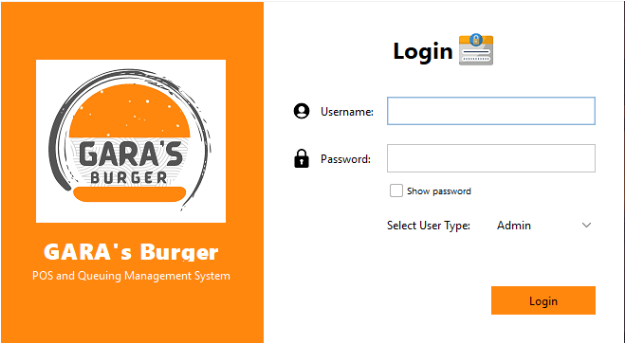
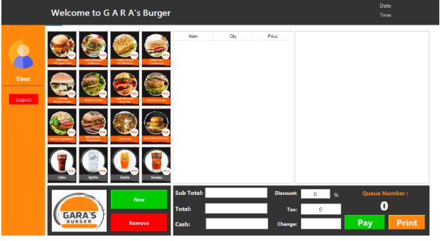
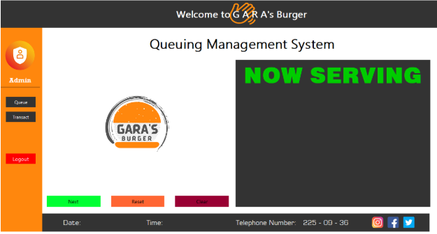
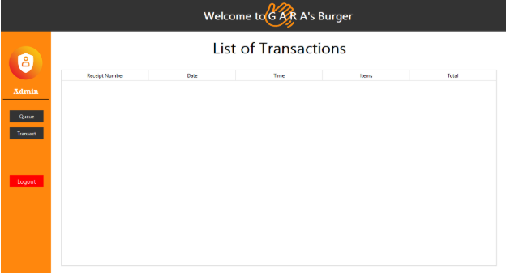

# GBurger
GARA's Burger POS and Queueing Management System

# 🍔 GARA's Burger POS and Queueing Management System

A **Point of Sale (POS)** and **Queueing Management System** designed for GARA's Burger.  
Built entirely in **Java**, this system manages customer orders, tracks sales, and handles queuing for efficient service flow.

---

## 📌 Features

✅ **Point of Sale (POS) Module**  
- Select burgers and add-ons  
- Auto-calculate total and change  
- Apply discounts or promos  
- Print receipts (file)

✅ **Queueing System**  
- Assign queue numbers to customers  
- Track order status: *Pending*, *Preparing*, *Ready for Pickup*  

✅ **Order Management**  
- View and update current orders  
- Cancel or complete orders

✅ **Sales Tracking**  
- View total sales per day  
- Track number of burgers sold

✅ **Admin Access**  
- Secure login before accessing main system

---

## 🛠️ Technologies Used

| Component   | Details       |
|-------------|----------------|
| Language    | **Java** |
| UI  | Java Swing / JavaFX |
| Storage     | File-based (`.txt`, `.csv`) and in-memory (ArrayList/Queue) |
| IDE         | Eclipse |

---

